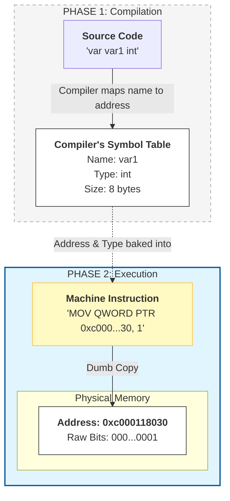
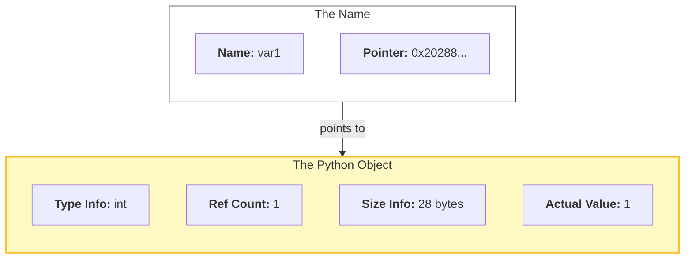

Variables are so fundamental that they become second nature: we name a value, access it, and change it later. But in Python, where any name can bind to any object, this flexibility is so extreme that systems programmers often claim Python has "names" rather than true variables. While this feels like a distinction without a difference in daily coding, it masks a profound mechanical divide. By comparing Python’s dynamic labels to Go's fixed memory locations, we can explore the reality of how these two languages actually interact with memory.
## The Mystery of the Changing Identity
**A quick note on scope:** I will use Go as our representative for statically typed languages, since that's the language I am learning right now. Regarding Python, we will focus specifically on **CPython**, the reference implementation, as its memory behavior defines the standard mental model for most Python developers.
To see the difference between the two models, we have to look past the values and look at the identity of the data. In CPython, we use the id() function to get the memory address of the object; in Go, we look at the memory address using the ampersand & operator.
### Example 1: Reassigning a Value
What happens to a variable’s identity when we give it a new value?

```Python
var1  = 1
print(var1, id(var1))
var1  = 2
print(var1, id(var1))
```
```Go
var var1 int
var1 = 1
fmt.Println(var1, &var1)
var1 = 2
fmt.Println(var1, &var1)
```
Let's run them and see the results:
```bash
bash$ python e1.py
1 2028852915024
2 2028852915264
bash$ go run e1.go
1 0xc000118030
2 0xc000118030
```
Curious, isn't it? In Python, changing the value changed the "identity" of the variable. In Go, the address stayed exactly the same.

### Example 2: Assignment to Another Variable
What happens when we set one variable to equal another?
```python
var1 = 999
print(var1, id(var1))
var2 = var1
print(var2, id(var2))
```
```Go
var var1 int
var var2 int
var1 = 999
fmt.Println(var1, &var1)
var2 = var1
fmt.Println(var2, &var2)
```
Let's run them and see the results:
```bash
bash$ python e2.py
999 2116704185168
999 2116704185168
bash$ go run e2.go
999 0xc000024070
999 0xc000024080
```
Now the behavior has flipped! In Python, the two variables now share a single identity. In Go, they have two completely different addresses.

## What assignment really means

The code we wrote for both languages is basically identical. But how languages interpret it is very different. 

Let's start with Go.
In Go, a variable must be declared before it can be used.  
```Go
var var1 int
```
This declaration tells the compiler two things: **how much** memory to reserve and **how to interpret** the bits stored there. From that moment on, the name var1 is tied to a specific, fixed memory address.

As shown in the diagram below, a Go variable is primarily a **compile-time construct**. While your source code uses names and types, the resulting machine code does not. The memory slot itself is simply a sequence of bits. The intelligence lives in the machine instructions, which are pre-calculated to treat that specific address as a 64-bit integer.


Because the memory is already reserved, you can access that address immediately—even before you've assigned a value. To ensure safety, Go automatically initializes this slot with a "zero-value" (like 0 for an integer) before you even touch it.

This leads us to the core of the Go model: **Assignment is a copy operation.** When you write `var1 = 1`, you are overwriting the bits inside the reserved slot.

This explains our earlier results:

- **Example 1:** Reassigning `var1` keeps the address the same because you are simply putting new data into the same memory slot.
- **Example 2:** Setting `var2 = var1` results in a new address because Go allocates a second, distinct memory slot for `var2` and copies the content of the first slot into it.


In Python, declarations are unnecessary because every variable is technically the same size. In a language like Go, the compiler needs a declaration to know whether to reserve 8 bits for a boolean or 64 bits for an integer. Python, however, stores all data in independent structures called PyObjects. Because these objects live elsewhere in memory, the variable itself only needs to hold a memory address (a pointer) to find them. Since every memory address is the same size (8 bytes on a 64-bit system), Python already knows exactly how much space to reserve for any name you create. 


When you write `var1 = 1`, Python creates the integer object first, then stores its address in the `var1` lookup dictionary or fixed size array. Assignment is simply the act of copying an 8-byte address into a slot, which is why a variable can point to an integer one moment and a string the next without ever changing its own internal structure.
We can see the opcodes for this operation if we check the bytecode the compiler generates for that line by disassembling our code (readable presentation of bytecode our program is compiled to):

```bash
bash$ python3 -m dis e1.py
...
  1           2 LOAD_CONST               0 (1)
              4 STORE_NAME               0 (var1)
...
```
When we execute `var1 = 2`, the process repeats: a new object is created at a new address, and the name tag is moved. This explains the "trick" in Example 1: the identity changes because the name is pointing to a completely different object.
In Example 2, we are simply binding an additional name to the exact same object (we don't need to create new one, since it already exists).

A lookup dictionary is not merely an analogy. Names in the global namespace of a module are held in literal dictionary accessible with the call of the `globals()'.
```python
globals()["var1"] = 1
print(var1)
```
In a local namespace (inside a function), Python optimizes this further. Instead of a literal dictionary, it uses a fixed-size array for faster access. While you can call `locals()` to see a dictionary-like representation of these variables, it is merely a read-only snapshot. Under the hood, the variable "names" are still just indices pointing to object addresses in that array.

## Conclusion
At first glance, Python’s fluid names and Go’s rigid memory slots seem like entirely different systems. Yet, as we have seen, the underlying mechanic is the same: both languages perform a **copy operation** during assignment. The real difference lies in **what** is being copied.

In Go, you are copying the actual data into a physical bucket. In Python, you are copying a memory address into a lookup table. This single layer of indirection is what defines each language’s character.

Understanding this distinction is the first step in moving from a developer who writes code to a programmer who understands how that code interacts with the machine.

Of course, we have only scratched the surface. To keep this introduction focused, I’ve intentionally steered clear of several deeper, inextricably connected topics: explicit pointers, the Stack vs. the Heap, and the crucial difference between mutating an object and rebinding a name. Those are stories for another time.
