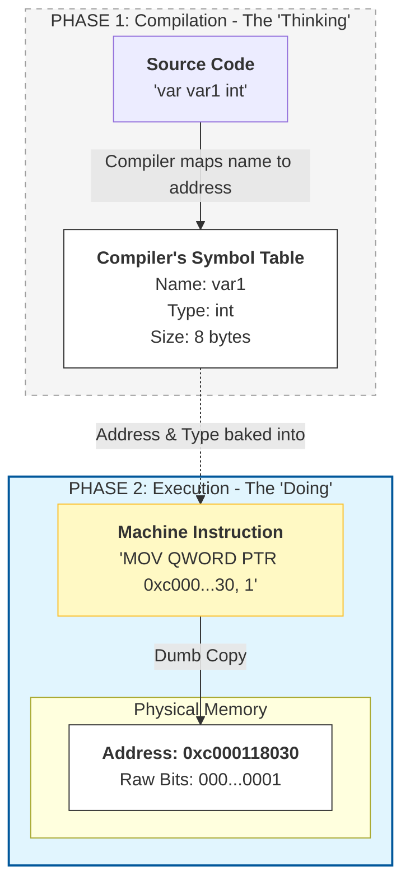
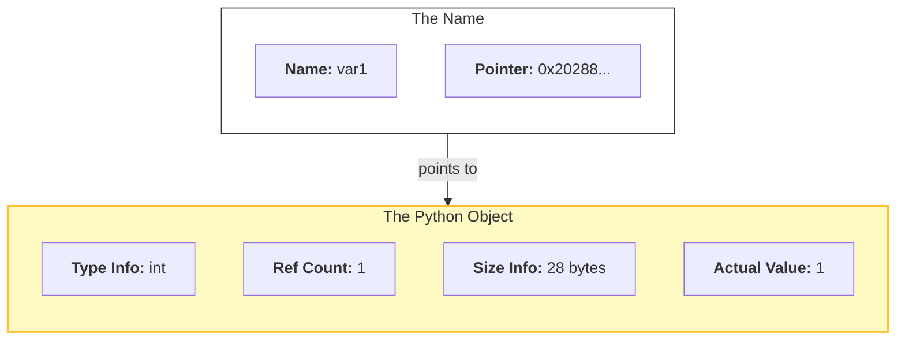

## Introduction
The variable is the most basic tool in a programmer's kit. Its use is so intuitive that we rarely stop to define what it even is. We give name to a value and access it later by invoking that name. We can then change that value still accessing it by the same name. A name with changeable value - a variable.
In Python, this is especially fluid. You can bind any name to any object, and everything in Python is an object. It’s a system so flexible that many systems programmers—those working in Go or C—argue that Python doesn't actually have variables at all; it only has "names."
At first, this feels like a distinction without a difference. For most daily tasks, it is. If you are curious about reality under the hood, however, in this article I will try to explore the difference between two systems of memory management.

## The Mystery of the Changing Identity
**A quick note on scope:** I will use Go as our representative for statically typed languages, since that's the language I am learning right now. Regarding Python, we will focus specifically on **CPython**, the reference implementation, as its memory behavior defines the standard mental model for most Python developers.
To see the difference between the two models, we have to look past the values and look at the identity of the data. In CPython, we use the id() function to get the memory address of the object; in Go, we look at the memory address using the ampersand & operator.

## Example 1: Reassigning a Value
What happens to a variable’s identity when we give it a new value?

```Python
var1  = 1
print(var1, id(var1))
var1  = 2
print(var1, id(var1))
```
```Go
var var1 int
var1 = 1
fmt.Println(var1, &var1)
var1 = 2
fmt.Println(var1, &var1)
```
Let's run them and see the results:
```bash
bash$ python e1.py
1 2028852915024
2 2028852915264
bash$ go run e1.go
1 0xc000118030
2 0xc000118030
```
Curious, isn't it? In Python, changing the value changed the "identity" of the variable. In Go, the address stayed exactly the same.

## Example 2: Assignment to Another Variable
What happens when we set one variable to equal another?
```python
var1 = 999
print(var1, id(var1))
var2 = var1
print(var2, id(var2))
```
```Go
var var1 int
var var2 int
var1 = 999
fmt.Println(var1, &var1)
var2 = var1
fmt.Println(var2, &var2)
```
Let's run them and see the results:
```bash
bash$ python e2.py
999 2116704185168
999 2116704185168
bash$ go run e2.go
999 0xc000024070
999 0xc000024080
```
Now the behavior has flipped! In Python, the two variables now share a single identity. In Go, they have two completely different addresses.

## What assignment really means

The code we wrote for both languages is basically identical. But how languages interpret it is very different. 
Let's start with Go.
In Go, a variable must be declared before it can be used.  
```Go
var var1 int
```
At compile time, this line of code does two things:
1. How much memory to reserve
2. How to interpret the data stored in that memory
From that moment on, that name and type are tied to a specific, fixed Addressable Memory Location, which is just that, a raw piece of memory.
In Go, the "Variable Definition" is primarily a compile-time construct. While the source code contains names and types, the resulting machine code does not. (Unless we compile with debug information, the names and types are not present in the executable.) The memory slot itself is "dumb"—it is simply a sequence of bits. The intelligence lives in the machine instructions, which have been pre-calculated to treat that specific address as a 64-bit integer.


Because the memory is already reserved, you can access that address immediately—even before you've assigned a value. Go ensures this is safe by initializing the memory with a zero-value (like 0 for an integer or an empty string).

Assignment in Go (`var1 = 1`) is a copy operation. The value is copied into the memory location reserved for the variable. 
This makes Example 1 easy to understand. The memory address is the part of the variable itself. That address will remain the same no matter how many times we reassign it with any value (of the correct type), because the slot is set in place.
Similarly, Example 2 becomes obvious: we copied the data from the first variable’s memory location into the second variable’s memory location. Two locations, two memory addresses, same content.


In Python, there is no need for a declaration step. Memory is only allocated when an object is actually created and belongs to the object, whether it is assigned to a variable or not. As for the type, we do not need to declare it. Remember that everything in Python is an object? It is not merely an OOP cliché, as far as variable is concerned - anything you assign to it is merely a Python object.
Assignment in Python is a binding operation. Specifically, a Python variable is a pointer stored in a lookup table (a dictionary or a fixed array). When you assign var1 = 999, you aren't putting the number 999 into the variable's slot; you are storing the memory address of a PyObject that contains the number. If you look at it this way, Python does perform a copy during assignment—it just copies the 8-byte address of an object rather than the object's actual data.

When evaluating a line like `var1 = 1`, Python starts on the right side. It creates an integer object out of the integer literal `1` and then binds it to the name `var1`.
We can actually see the bytecode for this operation if we check the bytecode compiler generates for that line by disassembling our code (readable presentation of bytecode our program is compiled to):
```bash
bash$ python3 -m dis e1.py
...
  1           2 LOAD_CONST               0 (1)
              4 STORE_NAME               0 (var1)
...
```
When we execute `var1 = 2`, the process repeats: a new object is created at a new address, and the name tag is moved. This explains the "trick" in Example 1: the identity changes because the name is pointing to a completely different object.
In Example 2, we are simply binding an additional name to the exact same object (we don't need to create new one, since it already exists).

Since the specific data type—whether it's an integer, a string, or a list—is stored inside the object itself, the variable is free to be a simple, lightweight label. 
This is why a variable in Python doesn't even need to exist until the moment you bind it to an object. Like a key in the dictionary.



A key in the dictionary is not merely an analogy. Names in the global namespace of a module are held in literal dictionary accessible with the call of the `globals()'.
```python
globals()["var1"] = 1
print(var1)
```
In a local namespace (inside a function), Python optimizes this further. Instead of a literal dictionary, it uses a fixed-size array for faster access. While you can call `locals()` to see a dictionary-like representation of these variables, it is merely a read-only snapshot. Under the hood, the variable "names" are still just indices pointing to object addresses in that array.

## Conclusion
For most daily tasks, the distinction between a Python "Name Binding" and a Go "Addressable Memory Location" is invisible. You assign a value, you pass it to a function, and the program runs. On the surface, the behavior of variables in almost every language remains remarkably similar.
However, as we have seen, the underlying models are built on different philosophies. Python chooses to prioritize the object, giving you a world of fluid, dynamic labels that make development fast and flexible. Go chooses to prioritize the location, giving you a fixed map of memory that makes the program predictable and incredibly fast.

If you want to look at this from a slightly different angle, the behavior of Python variables is actually identical to variables in Go or C. After all, CPython is implemented in C, and therefore somewhere down the line it must be a typed language. The key realization is that a Python variable's true type is always a pointer (specifically, a PyObject* in C). When you "rebind" a name in Python, you are performing a copy operation nearly identical to Go's, but you are only copying the address of an object into a new slot. Python feels dynamic because it hides this layer of indirection, while Go makes the distinction between a "Value" and a "Pointer" explicit, putting the choice—and the performance implications—directly in the hands of the programmer.

Of course, we have only scratched the surface. To keep this introduction focused, I’ve intentionally steered clear several deeper topics that, really, inextricably connected to the variables: pointers, process' memory (Stack vs. Heap), type systems, function arguments and data mutability (Mutation vs rebinding). Maybe another time we can talk about those.
