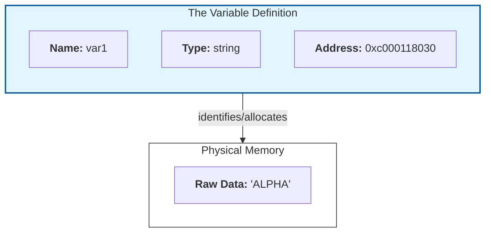
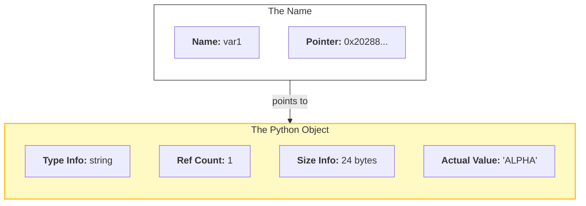

## Introduction
The variable is the most basic tool in a programmer's kit. Its use is so intuitive that we rarely stop to define what it even is. We give name to a value and access it later by invoking that name. We can then change that value still accessing it by the same name. A name with changeable value - a variable.
In Python, this is especially fluid. You can bind any name to any object, and everything in Python is an object. It’s a system so flexible that many systems programmers—those working in Go or C—argue that Python doesn't actually have variables at all; it only has "names."
At first, this feels like a distinction without a difference. For most daily tasks, it is. If you are curious about reality under the hood, however, in this article I will try to explore the difference between two systems of memory management.
I'll use Go as a statically typed language to compare Python to, since this is what I am learning right now.

## The Mystery of the Changing Identity
To see the difference between the two models, we have to look past the values and look at the identity of the data. In Python, we use the id() function; in Go, we look at the memory address using the ampersand & operator. Identity and memory address are roughly equivalent to each other for our purposes.

## Example 1: Reassigning a Value
What happens to a variable’s identity when we give it a new value?

```Python
var1  = "ALPHA"
print(var1, id(var1))
var1  = "BRAVO"
print(var1, id(var1))
```
```Go
var var1 string
var1 = "ALPHA"
fmt.Println(var1, &var1)
var1 = "BRAVO"
fmt.Println(var1, &var1)
```
Let's run them
```bash
> python e1.py
ALPHA 2028852915024
BRAVO 2028852915264
> go run e1.go
ALPHA 0xc000118030
BRAVO 0xc000118030
```
Curious, is not it? In Python, changing the value changed the "identity" of the variable. In Go, the address stayed exactly the same.

## Example 2: Assignment to Another Variable
What happens when we set one variable to equal another?
```python
var1 = "DELTA"
print(var1, id(var1))
var2 = var1
print(var2, id(var2))
```
```Go
var var1 string
var var2 string
var1 = "DELTA"
fmt.Println(var1, &var1)
var2 = var1
fmt.Println(var2, &var2)
```
```bash
> python e2.py
DELTA 2116704185168
DELTA 2116704185168
> go run e2.go
DELTA 0xc000024070
DELTA 0xc000024080
```
Now the behavior has flipped! In Python, the two variables now share a single identity. In Go, they have two completely different addresses.

## Declaration

In a statically typed language like Go, declaring a variable is a critical step. That line of code tells the compiler to reserve a specific amount of memory and associate it with a name. It also refers to the declared type of the variable for the dimensions for the memory footprint. From that moment on, that name is tied to a specific "Memory Slot" aka Addressable Memory Location. Memory Slot is just that, a raw piece of memory and variable that points to it bears all the metadata program may need to know about what lays in that slot.


Because the memory is already reserved, you can access that address immediately—even before you've assigned a value. Go ensures this is safe by initializing the memory with a zero-value (like 0 for an integer or an empty string).
At runtime of the go application, the "Variable Definition" is essentially baked into the machine code. The CPU just sees "Go to address 0xc...30 and treat those bits as a string."

In Python, there is no need for a declaration step. Memory is only allocated when an object is actually created, whether it is assigned to variable or not. As for the type, we do not need to declare it. Remember that everything in Python is an object? It is not merely an OOP saying, as far as variable is concerned - anything you assign to it is merely a Python object.
Because the specific data type—whether it's an integer, a string, or a list—is stored inside the object itself, the variable is free to be a simple, lightweight label. It is just a name for an object's memory address.
This is why a variable in Python doesn't even need to exist until the moment you bind it to an object. Like a key in the dictionary.



A key in the dictionary is not merely an analogy. Names in the global namespace of a module are held in literal dictionary accessible with the call of the `globals()'.
```python
globals()["var1"] = "ALPHA"
print(var1)
```
For variables in local namespace (inside function for example) it's a little more complicated - you can gain access to the dictionary of the local variables with the call to `locals()`, but it is merely a snapshot of the actual structure (fixed-size array) that holds local variables and therefore read-only.

## Assignment and Reassignment

In Go, assignment is a copy operation. Because the variable was already declared, it has its Memory Slot ready and waiting to accept data. When you assign a value, that data is copied into that prepared place. 
This makes Example 1 easy to understand. The memory address we see is the physical location of the "Slot" itself. That address will remain the same no matter how many times we reassign it with any value (of the correct type), because the slot is set in place.
Similarly, Example 2 becomes obvious: we copied the data from the first variable’s memory slot into the second variable’s memory slot. Two slots, two memory addresses, same content.

But what about Python? Since execution happens entirely at runtime, Python acts differently. When evaluating a line like `var1 = "ALPHA"`, Python starts on the right side. It creates a string object out of the literal `"ALPHA"` and then binds it to the name `var1`.
We can actually see the bytecode for this operation if we check the bytecode compiler generates for that line by disassembling our code:
```bash
bash$ python3 -m dis e1.py
...
  1           2 LOAD_CONST               0 ('ALPHA')
              4 STORE_NAME               0 (var1)
...
```
When we execute `var1 = "BRAVO"`, the process repeats: a new object is created at a new address, and the name tag is moved. This explains the "trick" in Example 1: the identity changes because the name is pointing to a completely different object.
In Example 2, we are simply binding an additional name to the exact same object (we don't need to create new one, since it already exists).

If you want to look at this from a slightly different angle, the behavior of Python variables is actually identical to variables in Go or C—if you imagine that value that every Python variable holds is a memory address of python object. And that address is what gets copied to a variable's slot during assignment. 

## Compile-time vs. Runtime.

The way I wrote it, it might seem that Go does more work, more copying, and should be slower than python, but empirically, we all know that it is much faster.
The answer lies in when the work happens.
In Go, the "thinking" happens at Compile-time.
When you build your program, the compiler performs a massive amount of optimization. It replaces human-friendly concepts like variable's name and type with raw machine instructions and fixed memory addresses. By the time the program runs, the CPU doesn't have to consider what type is the data, where is it or what is possible to do with it, it simply follows a pre-calculated map.
Furthermore, because Go knows the exact size of your variables before the program starts, it can use the Stack—a lightning-fast area of memory—to store data.

Names are text, and we can check their removal from executable. Now, Go is may not be best example for this since it adds a huge amount of code to every executable - the garbage collector. But we still grep executable's strings for names:
```bash
bash$ cat e1.go
package main

import "fmt"

func main() {
	var var1 string
	var1 = "ALPHA"
	fmt.Println(var1, &var1)
	var1 = "BRAVO"
	fmt.Println(var1, &var1)
}
bash$ go build e1.go
bash$ ./e1
ALPHA 0xc000014070
BRAVO 0xc000014070
bash$ strings e1 | grep -e var1 -e ALPHA -e BRAVO
...ALPHABRAVO...
```

In Python, the "thinking" happens at Runtime. Standard Python (CPython) does very little optimization when it translates your code into bytecode. This means that every time your program runs a line of code, the interpreter has to manually look up the name in a dictionary, check the object's type, and find its location on the Heap (a slower, more dynamic area of memory).
All the work the Go compiler does once, the Python interpreter must do constantly. Go trades a little extra "copying" for a massive gain in predictability and machine efficiency.

For Python after compiling the bytecode we can still see the names of the variables.
```bash
bash$ cat e1.py
var1 = "ALPHA"
print(var1, id(var1))
var1 = "BRAVO"
print(var1, id(var1))
bash$ python3 -m py_compile e1.py
bash$ strings __pycache__/e1.cpython-312.pyc | grep -e var1 -e ALPHA -e BRAVO
ALPHA
BRAVON)
var1
bash$ 
```

## Conclusion
For most daily tasks, the distinction between a Python "Name" and a Go "Memory Slot" is invisible. You assign a value, you pass it to a function, and the program runs. On the surface, the behavior of variables in almost every language remains remarkably similar.
However, as we have seen, the underlying models are built on different philosophies. Python chooses to prioritize the object, giving you a world of fluid, dynamic labels that make development fast and flexible. Go chooses to prioritize the location, giving you a fixed map of memory that makes the program predictable and incredibly fast.

Of course, we have only scratched the surface. To keep this introduction focused, I’ve intentionally steered clear several deeper topics that, really, inextricably connected to the variables: pointers, process' memory (Stack vs. Heap), type systems and data mutability. Maybe another time we can talk about those.
